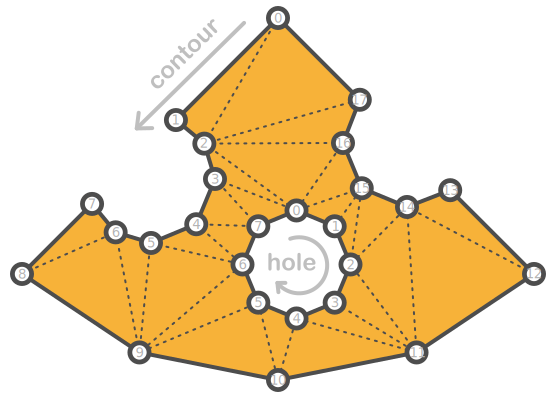

# iTriangle
A fast and efficient library for Delaunay triangulation and converting complex polygons into convex shapes, including advanced self-intersection resolution.
 
## Delaunay triangulation
<p align="center">
 
</p>

## Breaking into convex polygons
<p align="center">
 
</p>

## Features

- **Delaunay Triangulation**: *Efficient and robust implementation for generating Delaunay triangulations.*
- **Convex Polygons**: *Break complex polygons into simpler convex polygons.*
- **Self-Intersection**: *Smart intersection resolution with Even-Odd or Non-Zero rules.*

## Documentation
- [Delaunay](https://ishape-rust.github.io/iShape-js/triangle/delaunay.html)

## Code

After that, represent your polygon as an array of vertices. Here's an example of a cheese polygon:

<p align="center">
 
</p>

```rust
        let shape = FixShape::new_with_contour_and_holes(
            [
                F32Vec::new(0.0, 20.0).to_fix(),    // 0
                F32Vec::new(8.0, 10.0).to_fix(),    // 1
                F32Vec::new(7.0, 6.0).to_fix(),     // 2
                F32Vec::new(9.0, 1.0).to_fix(),     // 3
                F32Vec::new(13.0, -1.0).to_fix(),   // 4
                F32Vec::new(17.0, 1.0).to_fix(),    // 5
                F32Vec::new(26.0, -7.0).to_fix(),   // 6
                F32Vec::new(14.0, -15.0).to_fix(),  // 7
                F32Vec::new(0.0, -18.0).to_fix(),   // 8
                F32Vec::new(-14.0, -15.0).to_fix(), // 9
                F32Vec::new(-25.0, -7.0).to_fix(),  // 10
                F32Vec::new(-18.0, 0.0).to_fix(),   // 11
                F32Vec::new(-16.0, -3.0).to_fix(),  // 12
                F32Vec::new(-13.0, -4.0).to_fix(),  // 13
                F32Vec::new(-8.0, -2.0).to_fix(),   // 14
                F32Vec::new(-6.0, 2.0).to_fix(),    // 15
                F32Vec::new(-7.0, 6.0).to_fix(),    // 16
                F32Vec::new(-10.0, 8.0).to_fix()    // 17
            ].to_vec(),
            [[
                F32Vec::new(2.0, 0.0).to_fix(),     // 18
                F32Vec::new(-2.0, -2.0).to_fix(),   // 19
                F32Vec::new(-4.0, -5.0).to_fix(),   // 20
                F32Vec::new(-2.0, -9.0).to_fix(),   // 21
                F32Vec::new(2.0, -11.0).to_fix(),   // 22
                F32Vec::new(5.0, -9.0).to_fix(),    // 23
                F32Vec::new(7.0, -5.0).to_fix(),    // 24
                F32Vec::new(5.0, -2.0).to_fix()     // 25
            ].to_vec()].to_vec(),
        );

        let triangulation = shape.to_triangulation(Some(FillRule::NonZero));

        println!("points: {:?}", triangulation.points);
        println!("indices: {:?}", triangulation.indices);
```

**Output Triangulation**: *triangles indices and vertices, where all triangles oriented in a clockwise direction.*
