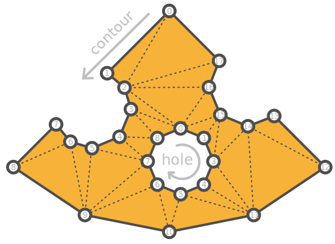

# iTriangle
A fast, stable, and robust triangulation library for 2D integer geometry — tested on over **10⁹ randomized inputs**.

## Delaunay triangulation
<p align="center">
 
</p>

## Breaking into convex polygons
<p align="center">
 
</p>

## Features

- **Raw Triangulation** - Fast and simple triangulation of polygons with or without holes.
- **Delaunay Triangulation** - Efficient and robust implementation for generating Delaunay triangulations.
- **Adaptive Tessellation** - Refine Delaunay triangles using circumcenters for better shape quality.
- **Convex Decomposition** - Convert triangulation into convex polygons.
- **Centroidal Polygon Net**: Build per-vertex dual polygons using triangle centers and edge midpoints.
- **Steiner Points**: Add custom inner points to influence triangulation.
- **Robust Geometry**: All operations use 2D integer arithmetic for maximum stability.

## Reliability

- Extremely Stable: The core triangulation and Delaunay algorithms have been tested against over 1 billion randomized polygon samples.
- Uses pure integer math to avoid floating-point precision issues.
- Designed for use in CAD, EDA, game engines, and any application where robustness is critical.

## Demo

- [Triangulation](https://ishape-rust.github.io/iShape-js/triangle/triangulation.html)

## Documentation
- [Delaunay](https://ishape-rust.github.io/iShape-js/triangle/delaunay.html)

## Getting Started

Add to your `Cargo.toml`:
```
[dependencies]
i_triangle = "^0.30.0"
```

After that, represent your polygon as an array of vertices. Here's an example of a cheese polygon:

<p align="center">
 
</p>

```rust
let shape = vec![
    vec![
        // body
        [0.0, 20.0],    // 0
        [8.0, 10.0],    // 1
        [7.0, 6.0],     // 2
        [9.0, 1.0],     // 3
        [13.0, -1.0],   // 4
        [17.0, 1.0],    // 5
        [26.0, -7.0],   // 6
        [14.0, -15.0],  // 7
        [0.0, -18.0],   // 8
        [-14.0, -15.0], // 9
        [-25.0, -7.0],  // 10
        [-18.0, 0.0],   // 11
        [-16.0, -3.0],  // 12
        [-13.0, -4.0],  // 13
        [-8.0, -2.0],   // 14
        [-6.0, 2.0],    // 15
        [-7.0, 6.0],    // 16
        [-10.0, 8.0],   // 17
    ],
    vec![
        // hole
        [2.0, 0.0],   // 18
        [-2.0, -2.0], // 19
        [-4.0, -5.0], // 20
        [-2.0, -9.0], // 21
        [2.0, -11.0], // 22
        [5.0, -9.0],  // 23
        [7.0, -5.0],  // 24
        [5.0, -2.0],  // 25
    ],
];

let triangulation = shape.triangulate().to_triangulation();

println!("points: {:?}", triangulation.points);
println!("indices: {:?}", triangulation.indices);

let delaunay_triangulation = shape.triangulate()
    .into_delaunay()
    .to_triangulation();

println!("points: {:?}", delaunay_triangulation.points);
println!("indices: {:?}", delaunay_triangulation.indices);

let convex_polygons = shape.triangulate()
    .into_delaunay()
    .to_convex_polygons();

println!("convex polygons: {:?}", convex_polygons);
```

**Output Triangulation**: *triangles indices and vertices, where all triangles oriented in a counter-clockwise direction.*
