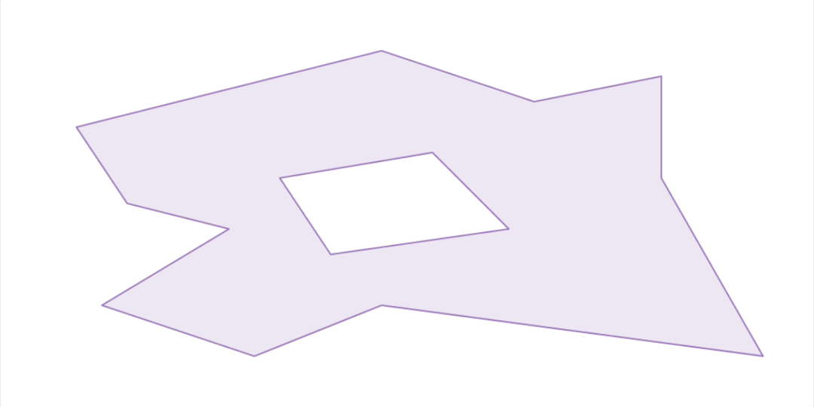
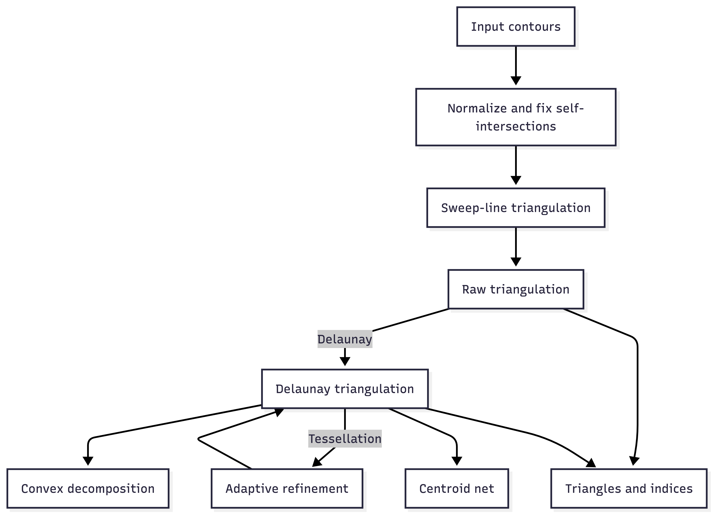
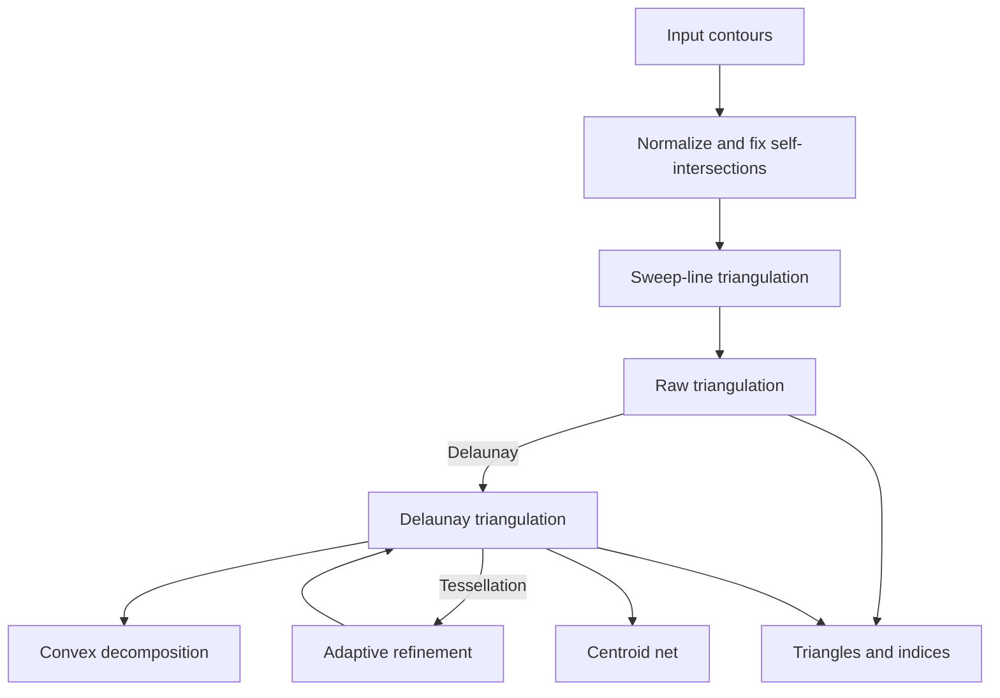
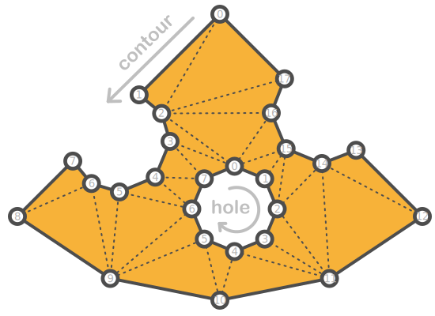
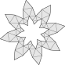
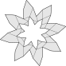
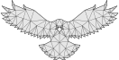
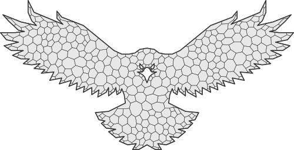

# iTriangle

[](https://crates.io/crates/i_triangle)

[](https://docs.rs/i_triangle)
[](https://github.com/iShape-Rust/iTriangle/actions/workflows/tests.yml)
[](https://codecov.io/gh/iShape-Rust/iTriangle)
[](https://crates.io/crates/i_triangle)

iTriangle is a high-performance 2D polygon triangulation library for Rust. It solves robust triangulation for real-world, messy input (holes, self-intersections, mixed winding) and is built for GIS/CAD, simulation, and rendering pipelines that need deterministic results.

*For detailed performance benchmarks, check out the* [Performance Comparison](https://ishape-rust.github.io/iShape-js/triangle/performance/performance.html)



## Table of Contents

- [Why iTriangle?](#why-itriangle)
- [Features](#features)
- [Architecture Overview](#architecture-overview)
- [Quick Start](#quick-start)
- [Documentation](#documentation)
- [Examples](#examples)
- [Integer API](#integer-api)
- [Performance](#performance)
- [Gallery](#gallery)
- [Contributing](#contributing)
- [License](#license)

## Why iTriangle?

- Robust on complex input: supports holes and self-intersections with automatic resolution.
- Deterministic and stable: integer-based core avoids floating-point corner cases.
- High-performance: optimized sweep-line triangulation with cache-friendly outputs.
- Flexible outputs: Delaunay, convex decomposition, tessellation, and centroid nets.

## Features

- **Sweep-line Triangulation** - Fast and simple triangulation of polygons with or without holes.
- **Delaunay Triangulation** - Efficient and robust implementation for generating Delaunay triangulations.
- **Self-Intersection Handling** – Fully supports self-intersecting polygons with automatic resolution.
- **Adaptive Tessellation** - Refine Delaunay triangles using circumcenters for better shape quality.
- **Convex Decomposition** - Convert triangulation into convex polygons.
- **Centroidal Polygon Net**: Build per-vertex dual polygons using triangle centers and edge midpoints.
- **Steiner Points**: Add custom inner points to influence triangulation.
- **GPU-Friendly Layout**: Triangles and vertices are naturally ordered by X due to the sweep-line algorithm, improving cache locality for rendering.

## Architecture Overview



<details>
<summary>Mermaid source</summary>


```mermaid
flowchart TD
    A[Input contours] --> B[Normalize and fix self-intersections]
    B --> C[Sweep-line triangulation]
    C --> D[Raw triangulation]
    D -->|Delaunay| E[Delaunay triangulation]
    D --> I[Triangles and indices]
    E -->|Tessellation| F[Adaptive refinement]
    F --> E
    E --> G[Convex decomposition]
    E --> H[Centroid net]
    E --> I
```

</details>

## Quick Start

Add to your `Cargo.toml`:

```toml
[dependencies]
i_triangle = "0.43"
```

Minimal example:

```rust
use i_triangle::float::triangulatable::Triangulatable;

let contour = vec![
    [0.0, 0.0],
    [10.0, 0.0],
    [10.0, 10.0],
    [0.0, 10.0],
];

let triangulation = vec![contour].triangulate().to_triangulation::<u16>();
println!("triangles: {}", triangulation.indices.len() / 3);
```

## Documentation

- [Docs.rs](https://docs.rs/i_triangle)
- [Delaunay](https://ishape-rust.github.io/iShape-js/triangle/delaunay.html)
- [Demos](https://ishape-rust.github.io/iShape-js/triangle/triangulation.html)

## Examples

### Single Shape Triangulation



```rust
use i_triangle::float::triangulatable::Triangulatable;
use i_triangle::float::triangulation::Triangulation;

let shape = vec![
    vec![
        // body
        [0.0, 20.0],    // 0
        [-10.0, 8.0],   // 1
        [-7.0, 6.0],    // 2
        [-6.0, 2.0],    // 3
        [-8.0, -2.0],   // 4
        [-13.0, -4.0],  // 5
        [-16.0, -3.0],  // 6
        [-18.0, 0.0],   // 7
        [-25.0, -7.0],  // 8
        [-14.0, -15.0], // 9
        [0.0, -18.0],   // 10
        [14.0, -15.0],  // 11
        [26.0, -7.0],   // 12
        [17.0, 1.0],    // 13
        [13.0, -1.0],   // 14
        [9.0, 1.0],     // 15
        [7.0, 6.0],     // 16
        [8.0, 10.0],    // 17
    ],
    vec![
        // hole
        [2.0, 0.0],   // 0
        [5.0, -2.0],  // 1
        [7.0, -5.0],  // 2
        [5.0, -9.0],  // 3
        [2.0, -11.0], // 4
        [-2.0, -9.0], // 5
        [-4.0, -5.0], // 6
        [-2.0, -2.0], // 7
    ],
];

let triangulation = shape.triangulate().to_triangulation::<u16>();

println!("points: {:?}", triangulation.points);
println!("indices: {:?}", triangulation.indices);

let delaunay_triangulation: Triangulation<[f64; 2], u16> =
    shape.triangulate().into_delaunay().to_triangulation();

println!("points: {:?}", delaunay_triangulation.points);
println!("indices: {:?}", delaunay_triangulation.indices);

let convex_polygons = shape.triangulate().into_delaunay().to_convex_polygons();

println!("convex polygons: {:?}", convex_polygons);

let tessellation: Triangulation<[f64; 2], u16> = shape
    .triangulate()
    .into_delaunay()
    .refine_with_circumcenters_by_obtuse_angle(0.0)
    .to_triangulation();

println!("points: {:?}", tessellation.points);
println!("indices: {:?}", tessellation.indices);

let centroids = shape
    .triangulate()
    .into_delaunay()
    .refine_with_circumcenters_by_obtuse_angle(0.0)
    .to_centroid_net(0.0);

println!("centroids: {:?}", centroids);
```

> 💡 Output: Triangle indices and vertices, where all triangles oriented in a **counter-clockwise** direction.

### Triangulating Multiple Shapes Efficiently

If you need to triangulate many shapes, it is more efficient to use `Triangulator`.

```rust
use i_triangle::float::triangulation::Triangulation;
use i_triangle::float::triangulator::Triangulator;

let contours = vec![
    vec![[0.0, 0.0], [4.0, 0.0], [4.0, 4.0], [0.0, 4.0]],
    vec![[5.0, 0.0], [9.0, 0.0], [9.0, 4.0], [5.0, 4.0]],
];

let mut triangulator = Triangulator::<u32>::default();

// Enable Delaunay refinement
triangulator.delaunay(true);

// Use fast Earcut solver for contours with ≤ 64 points
triangulator.earcut(true);

let mut triangulation = Triangulation::with_capacity(100);

for contour in contours.iter() {
    // Triangulate using self-intersection resolver
    triangulator.triangulate_into(contour, &mut triangulation);

    println!("points: {:?}", triangulation.points);
    println!("indices: {:?}", triangulation.indices);
}
```

## Integer API

The integer API is useful when your coordinates are already quantized or when you want direct control over the robust integer core. It avoids float-to-int adapter setup and returns integer points unchanged.

Use `IntPoint` with `IntContour`, `IntShape`, or `IntShapes`-compatible containers:

```rust
use i_triangle::int::triangulatable::IntTriangulatable;
use i_triangle::i_overlay::i_float::int::point::IntPoint;

let contour = vec![
    IntPoint::new(0, 0),
    IntPoint::new(10, 0),
    IntPoint::new(10, 10),
    IntPoint::new(0, 10),
];

let triangulation = contour.triangulate().into_triangulation::<u16>();

assert_eq!(triangulation.points.len(), 4);
assert_eq!(triangulation.indices.len(), 6);
```

For repeated triangulation, use `IntTriangulator` and reuse its internal buffers:

```rust
use i_triangle::int::triangulation::IntTriangulation;
use i_triangle::int::triangulator::IntTriangulator;
use i_triangle::i_overlay::i_float::int::point::IntPoint;

let contours = vec![
    vec![
        IntPoint::new(0, 0),
        IntPoint::new(10, 0),
        IntPoint::new(10, 10),
        IntPoint::new(0, 10),
    ],
    vec![
        IntPoint::new(20, 0),
        IntPoint::new(30, 0),
        IntPoint::new(30, 10),
        IntPoint::new(20, 10),
    ],
];

let mut triangulator = IntTriangulator::<u32>::default();
let mut output = IntTriangulation::<u32>::default();

for contour in &contours {
    triangulator.triangulate_contour_into(contour.clone(), &mut output);
    assert!(!output.indices.is_empty());
}
```

If your integer contours are already valid and correctly oriented, the unchecked API skips validation:

```rust
use i_triangle::int::unchecked::IntUncheckedTriangulatable;
use i_triangle::i_overlay::i_float::int::point::IntPoint;

let contour = vec![
    IntPoint::new(0, 0),
    IntPoint::new(10, 0),
    IntPoint::new(10, 10),
    IntPoint::new(0, 10),
];

let triangulation = contour.uncheck_triangulate().into_triangulation::<u16>();
assert_eq!(triangulation.indices.len(), 6);
```

## Performance

Benchmarks and interactive demos are available here:
- [Performance Comparison](https://ishape-rust.github.io/iShape-js/triangle/performance/performance.html)
- [Triangulation Demo](https://ishape-rust.github.io/iShape-js/triangle/triangulation.html)
- [Tessellation Demo](https://ishape-rust.github.io/iShape-js/triangle/tessellation.html)

## Gallery

| Delaunay | Convex Polygons | Steiner Points |
| --- | --- | --- |
|  |  |  |

| Tessellation | Centroid Net | |
| --- | --- | --- |
|  |  | |

## Contributing

See `CONTRIBUTING.md` for development setup, tests, and PR guidelines.

## License

Licensed under either of:
- MIT license (LICENSE-MIT)
- Apache License, Version 2.0 (LICENSE-APACHE)
